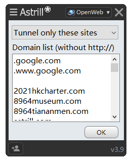

# shadowsocks-whitelist

翻墙白名单由 https://ibug.io/project/pac-generator/ 生成。

用户规则的匹配方式是简单的字符串结尾匹配（endsWith）。

## 安装

把whitelist.pac重命名为pac.txt，放到[shadowsocks](https://github.com/shadowsocks/shadowsocks-windows)目录。shadowsocks选择PAC模式->使用本地PAC。

本PAC规则同时支持[v2rayN](https://github.com/2dust/v2rayN)。


## Astrill VPN

Astrill VPN 不能直接使用PAC文件，但Astrill VPN的OpenWeb提供了Tunnel Only和Exclude模式，把PAC文件开头的网址贴上就行。

注意，只有OpenWeb模式接受网址匹配，其他模式用的是IP匹配。

注意，hklist目前对google.com采用了特殊匹配，即代理www.google.com和google.com，而无需代理比如translate.google.com、mail.google.com。所以OpenWeb的代理规则应该有

```
.google.com
.www.google.com
```




